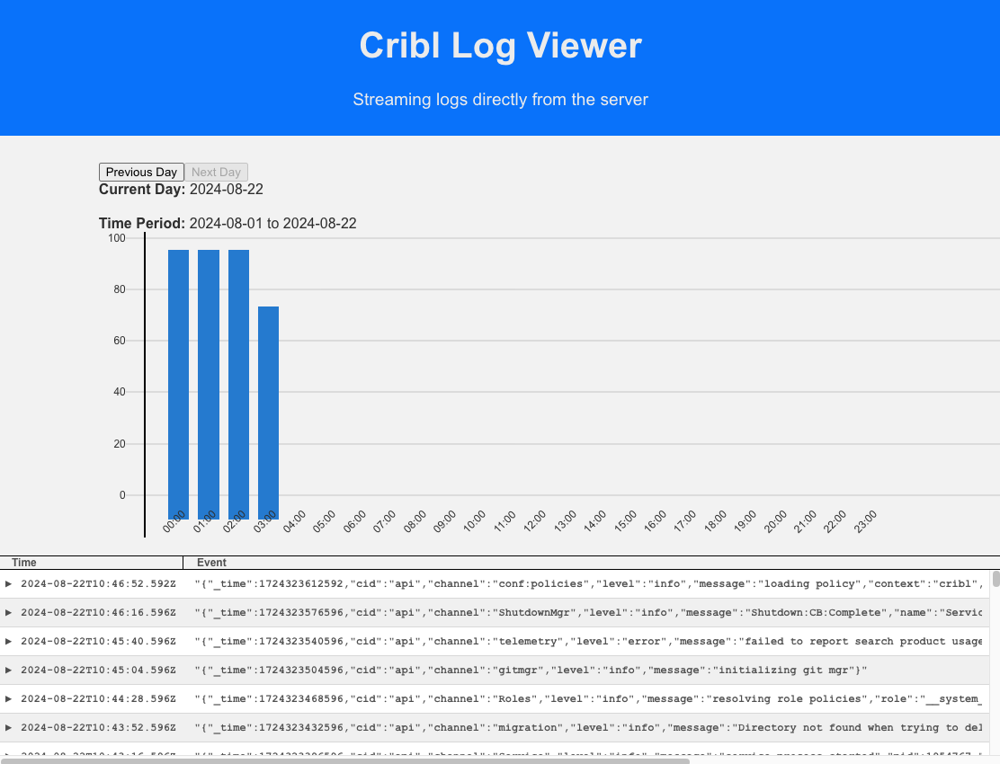
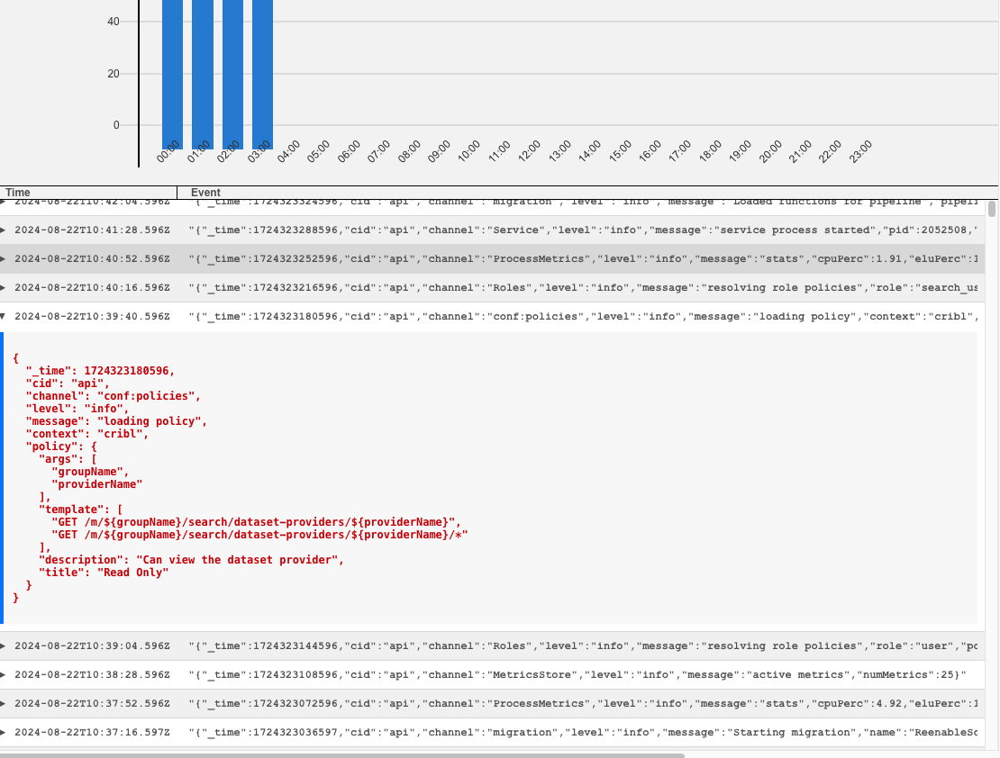

# Cribl Log Viewer

#### Richard Nguyen(Husey)






A React-based log viewer that streams and displays log entries in real-time as they are fetched from the server. This project was developed as part of a Cribl interview process, focusing on real-time log handling and expandable log entries.

## Key Features

- **Real-time Log Streaming**: Logs are streamed directly from a remote URL and displayed immediately as they arrive, without waiting for the entire file to download.
- **Expandable Log Entries**: Users can expand any log entry to view its full details in multiline JSON format.
- **Timeline Visualization**: Displays the distribution of log events over time using a custom timeline chart.
- **Optimized for Performance**: Efficiently handles large log files by rendering events as they are streamed, leveraging React Window for virtualized lists.

## Project Structure

- **`src/components/`**: Contains key components like:
  - `Header`: Displays the application header.
  - `LogEntry`: Manages individual log entries with expandable content.
  - `LogTable`: Renders log entries in a virtualized table.
  - `Timeline`: A timeline component showing log event distribution.
- **`src/hooks/`**: Contains custom hooks for managing log fetching and UI resizing.
- **`src/context/`**: Provides global state management for log data.
- **`src/utils/`**: Utility functions for tasks like date formatting.
- **`src/pages/`**: Main application entry point.

## Technology Stack

- **React**: Main framework for building the UI.
- **TypeScript**: Ensures type safety and improved code quality.
- **React Window**: Efficient rendering of large lists for improved performance.
- **Context API**: Used for global state management, providing log data to the entire application.
- **Streaming Data Fetch**: Implemented using native browser APIs to fetch logs as they are streamed from the server, improving the time-to-first-byte (TTFB) and overall user experience.
- **Caching**: Optimizes performance by caching log data, reducing redundant data fetches and improving application responsiveness.
- **React Testing Library**: For unit testing key components and verifying functionality.

## Demo
- **https://codesandbox.io/p/github/RichardHusey/log-viewer/draft/reverent-feynman?workspaceId=15236f99-f0f4-4211-9a7c-8fe4b8c53119**
## Installation and Setup

To get started with the project, follow these steps:

1. **Clone the repository**:
   ```bash
   git clone https://github.com/RichardHusey/log-viewer.git
2. **Install dependencies**:
   ```bash
   npm install
3. **Run the development server**:
   ```bash
   npm start
4. **Open the app: Visit http://localhost:3000**

## Usage

- **Logs are fetched from the provided URL:**: https://s3.amazonaws.com/io.cribl.c021.takehome/cribl.log
- **The log entries are displayed in a table with two columns:**: 
  - Timestamp: ISO 8601 formatted time.
  - Log Event: A JSON object represented in a single line.

- **Click on any row to expand and view the full log event in a multiline format.**
- **Use the timeline to view log event distribution by the hour.**

## Running Test

To get started testing, follow these steps:

1. **Clone the repository**:
   ```bash
   npm test
2. **Test Coverage**:

- **Header Component**: Verifies proper rendering of the header elements.
- **LogEntry Component**: Tests the expand/collapse functionality for log entries, ensuring accessibility and focus management.
- **LogTable Component**: Ensures efficient rendering of log entries and dynamic row sizing for large datasets.
- **Timeline Component**: Validates the correct visualization of log events distribution over time and interaction with navigation controls.

## Future Enhancements

- **Improved Test Coverage**: Expand test cases to include edge cases, more scenarios for log streaming, and performance-related testing.
- **Error Handling**: Implement advanced error handling and recovery mechanisms for network issues or corrupted data streams.
- **Performance Optimization**: Further optimize the timeline component and rendering logic to handle larger datasets more efficiently, including lazy loading and memoization strategies.
